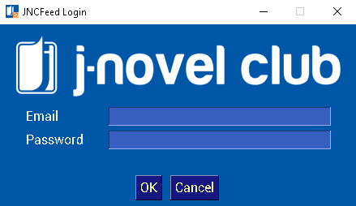
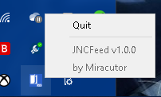

#  JNCFeed
A Python application that can inform you of the latest parts availability of your followed series on J-Novel Club.  
  
[](https://github.com/Miracutor/JNCFeed/blob/master/LICENSE)
[](https://github.com/Miracutor/JNCFeed/releases/)
[](https://GitHub.com/Miracutor/JNCFeed/releases/)


[](https://www.python.org/)

## Disclaimer
JNCFeed is completely unaffiliated with J-Novel Club.
The logo that used in this program owned by J-Novel Club.
It is only used in this app as a visual aid for the user.
## Screenshots


## Installation
1. Make sure you have a J-Novel Club account and an active subscription (Free or Premium) on the site.
2. Download the zip from the [Releases](https://github.com/Miracutor/JNCFeed/releases/) page.
3. Extract to any folder that you want. Preferably, placed on easy to access place.
4. Launch this application, JNCFeed.exe. You will be prompted to enter your login credentials.
   This process will only be done once. (And the app will also not going to keep your login info. Don't worry!)
5. Launch the application again. You will see the app icon on the system tray. You can use that tray to quit the app.
## Usage
- Just launch JNCFeed.exe and when the icon appears on the system tray, the app successfully launched.
- You will receive the notification at the start of the application and in interval of 30 minutes after launch.
- Right-click the icon on the system tray and click "Quit" to quit the application.
## Tips
- Add the application shortcut to Startup folder to make sure the application launch automatically every time you open your computer.
  You can access the Startup folder by pressing Windows key + R and type ```shell:startup```.
- You can reset the app data by deleting .jncfeed folder in Home directory. (For Windows, it is C:\Users\\[username])  
  Next time you launch the application again, you will be prompted to the login screen.
## Building
### Requirements
- Windows 10. (Other platforms may and may not work. Never tested, so I don't know.)
- Python 3.7 and above. I used Python 3.7.9 when developing and building this app.
- Pipenv tool (https://pypi.org/project/pipenv/)
### Instructions
1. Rebuild the Pyinstaller bootloader.
   This step is required to reduce this program false positive detection as a virus. (It's not a virus!🤣)
   - Download the latest release of Pyinstaller archive [here](https://github.com/pyinstaller/pyinstaller/releases).
     Make sure it is the same version as the latest on PyPi.
   - Extract the archive.
   - Go to UnpackedFolder/bootloader and execute this command ```python ./waf all```.
   - Go back to UnpackedFolder and create a wheel using extra commands based on your platform not using the generic bdist_wheel command.
     Check out the extra commands using ```python setup.py --help-commands```.
   - Edit the pyinstaller path on Pipfile to your generated wheel.
2. Set up the development environment.  
   > pipenv install --dev
3. (Windows) Update SQLite
   Because Python 3.7, 3.8 on Windows used older SQLite dll, it needs to be updated to the latest version.
   - Download the dll [here](https://www.sqlite.org/download.html).
   - After that, make a backup of the original sqlite3.dll in Python37/dll and replace it with the new version.
4. Start building!
   - For Windows:  
   > pipenv run build-win
   - For other platforms:  
   > pipenv run build-other
5. Finished build on dist folder.
## License
JNCFeed is licensed under the GPLv3.0 license. Refer to [LICENSE](LICENSE) for more information.
```
JNCFeed is a Python application that can inform you of the latest parts availability of your followed series on J-Novel Club.

Copyright (C) 2021 Miracutor

This program is free software: you can redistribute it and/or modify
it under the terms of the GNU General Public License as published by
the Free Software Foundation, either version 3 of the License, or
(at your option) any later version.

This program is distributed in the hope that it will be useful,
but WITHOUT ANY WARRANTY; without even the implied warranty of
MERCHANTABILITY or FITNESS FOR A PARTICULAR PURPOSE.  See the
GNU General Public License for more details.

You should have received a copy of the GNU General Public License
along with this program.  If not, see <https://www.gnu.org/licenses/>.
```
## Credits
Done for you - from [Notification Sounds](https://notificationsounds.com/)
